# Mobile webshop for cakes and cookies created using Ionic

Simple webshop created using Ionic+React and NodeJS on backend, with MongoDB database.

## Users can:

- see products (cakes and cookies)
- see details about product
- add products to cart
- see products in cart
- make purchase
  Both users and sellers receive message about successful purchase, with some relevant details (sellers - purchased products, and info details about buyer, buyer - purchased products)

## Technologies used

### Front-end:

- Ionic+React (Typescript)
- CSS
- React Bootstrap

### Back-end:

- NodeJS (Express)
- MongoDB (for database)

## APIs used:

- Sendgrid(https://sendgrid.com/)

## Screenshots

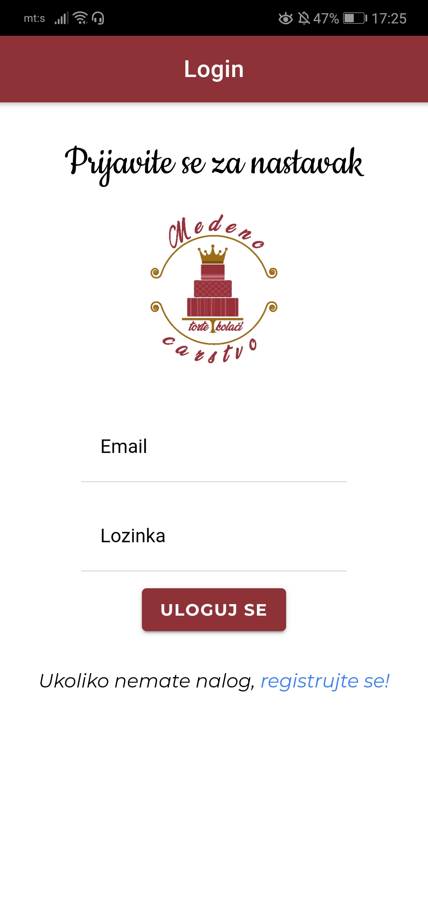
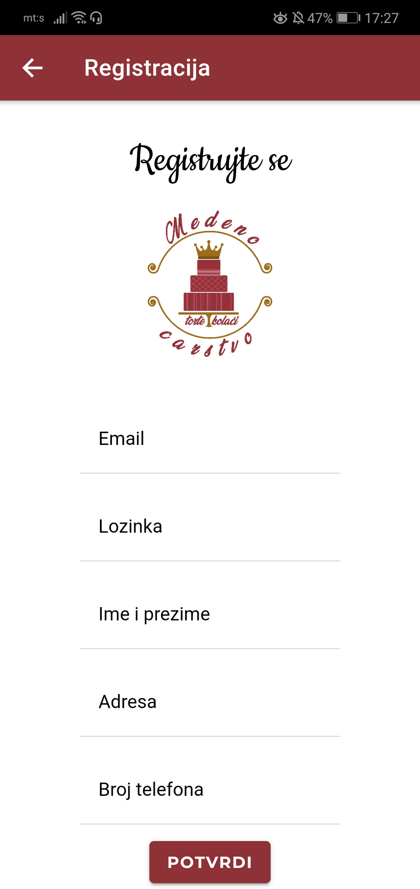
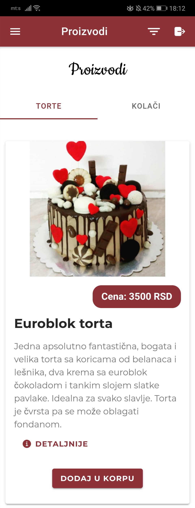
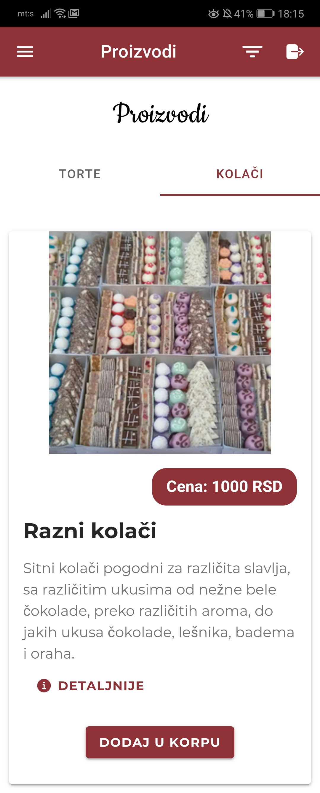
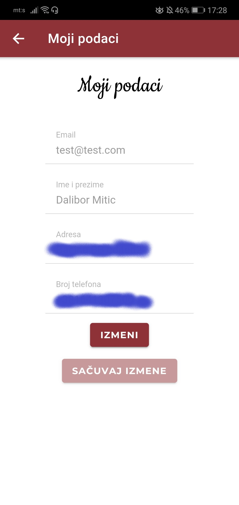
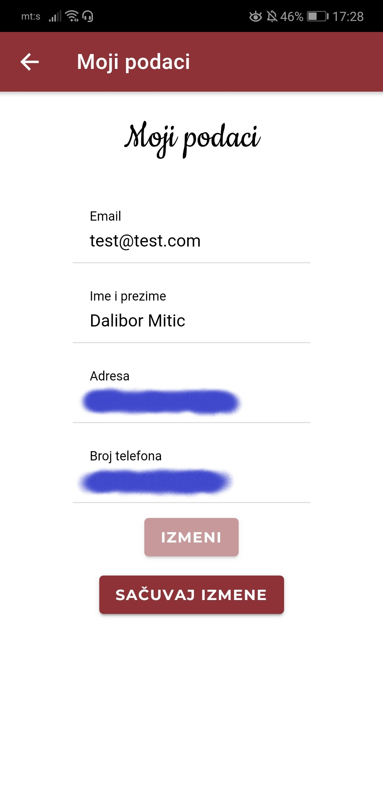
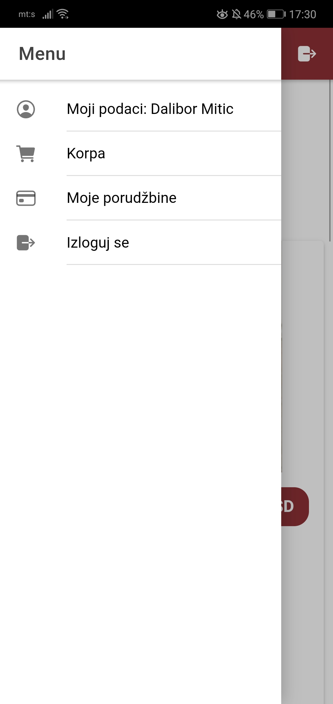
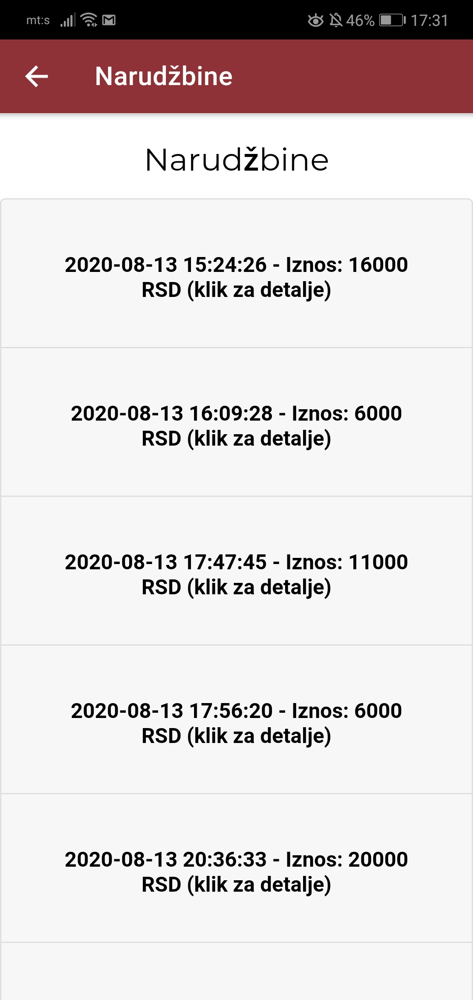
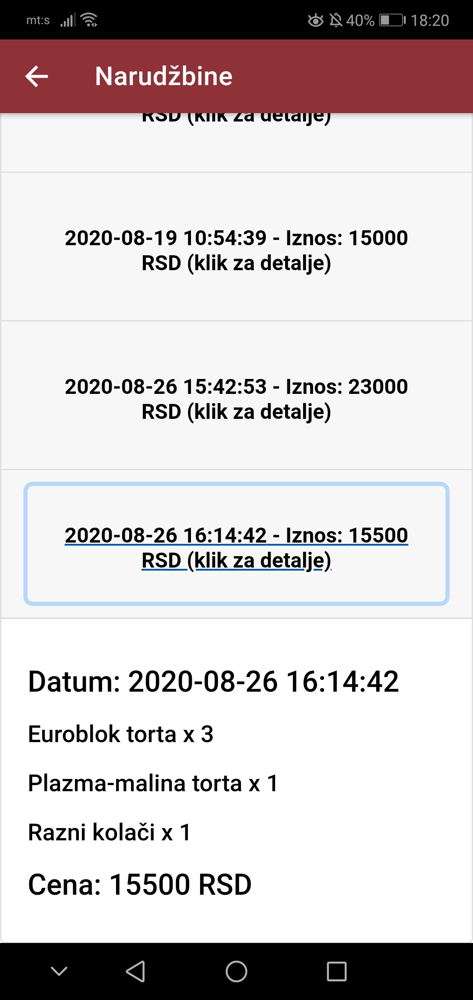
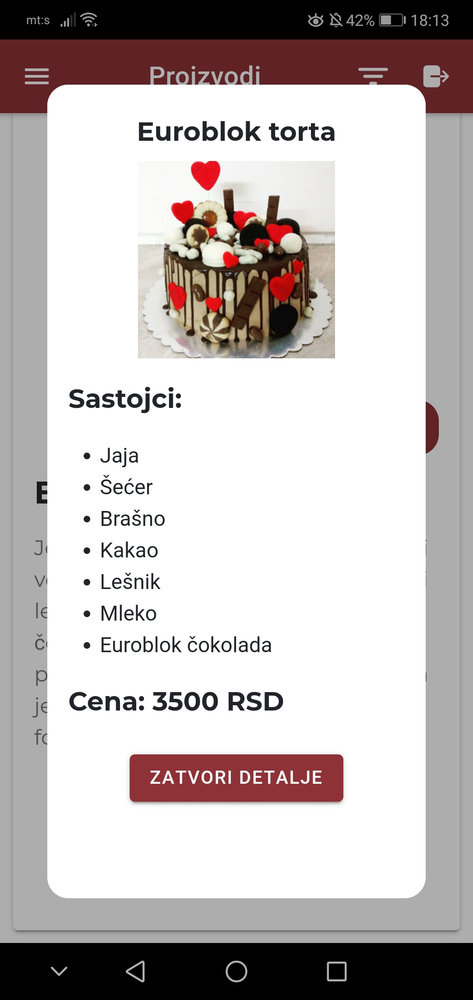
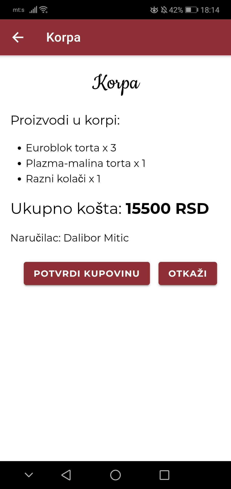
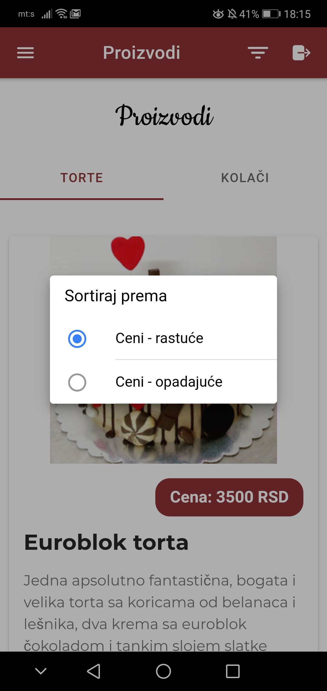
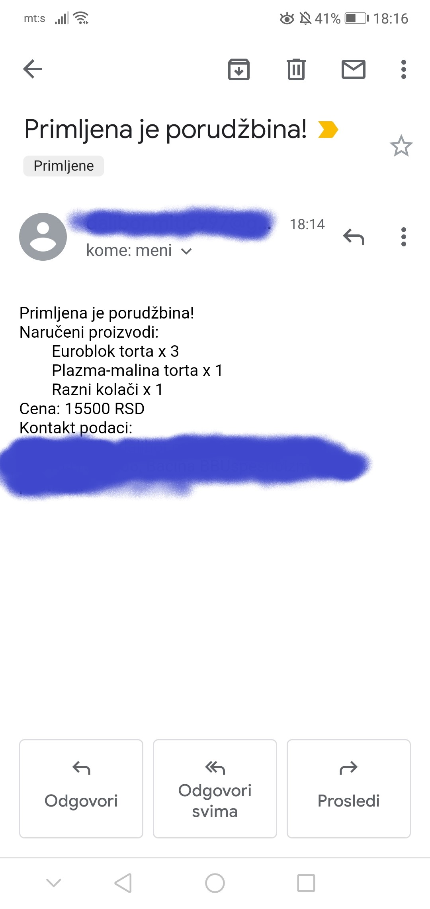
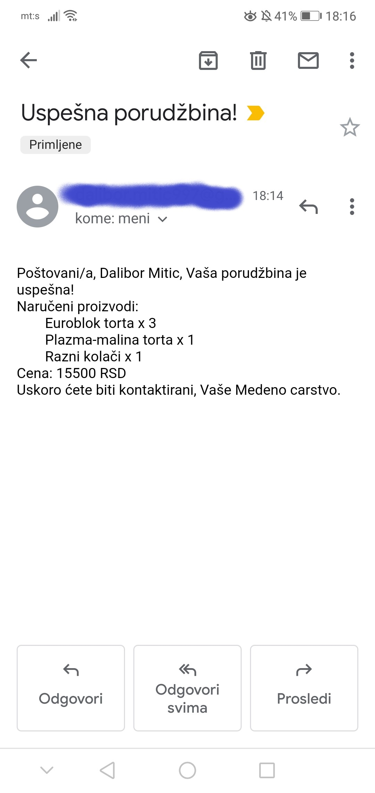
